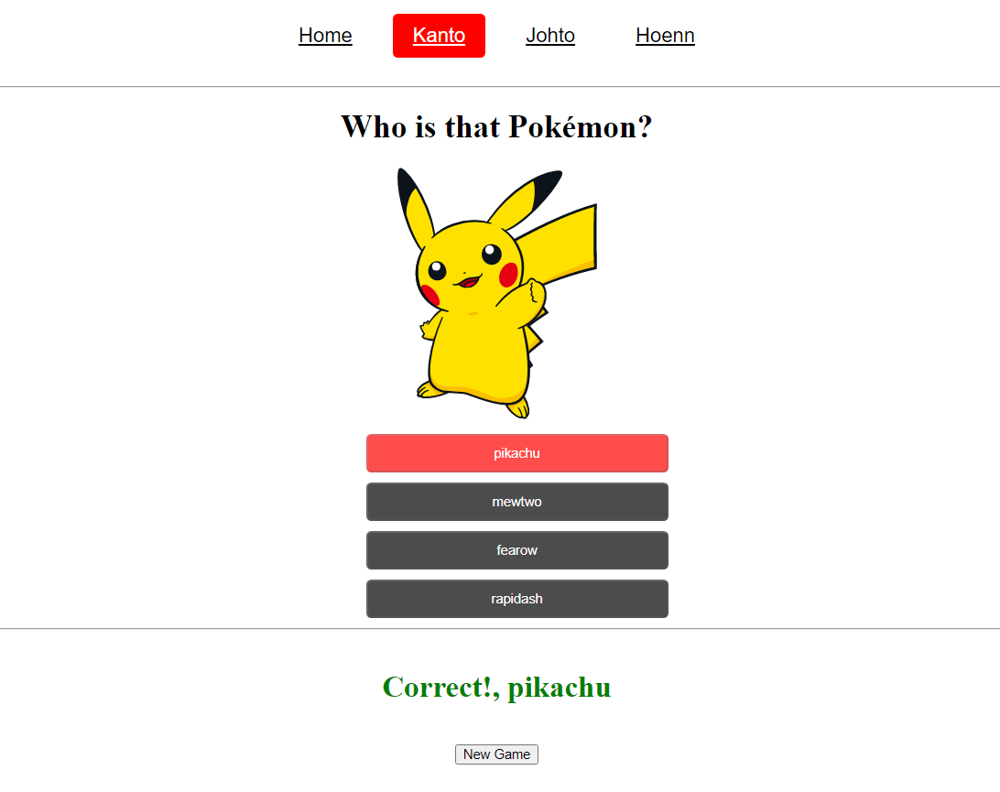

# Who is that Pokémon? - Game

[WITP](https://diablo3dp-vue3.netlify.app/): React app created with Vite [Vite](https://vitejs.dev/) that consume [PokéApi](https://pokeapi.co/) API, a Pokémon's game.

---



---
## Project setup
```markdown
# Install
npm install

# Compiles and hot-reloads for development
npm run serve

# Compiles and minifies for production
npm run build

```

---